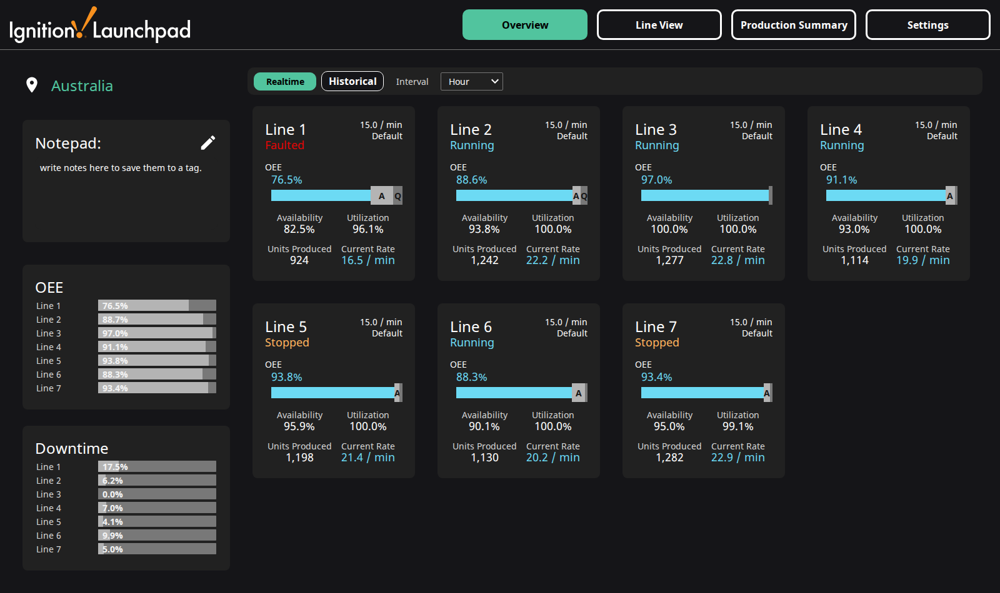
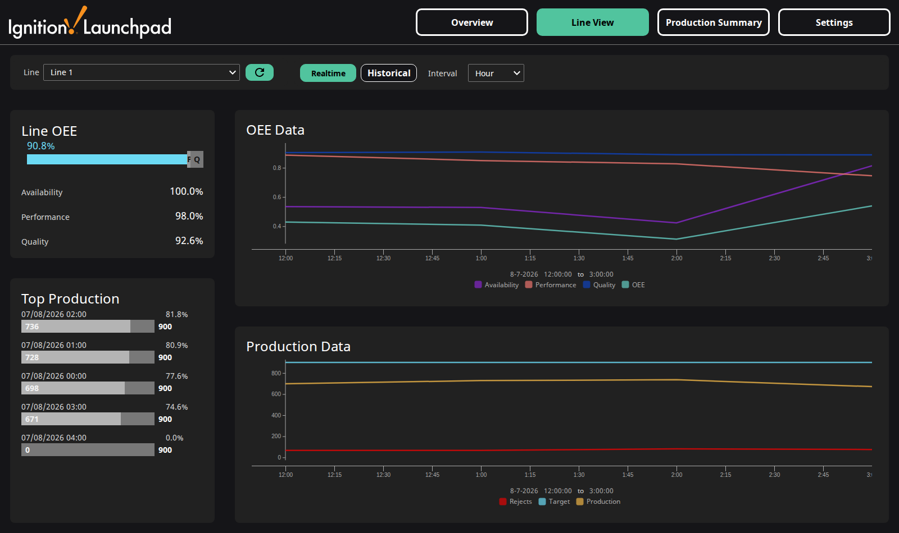
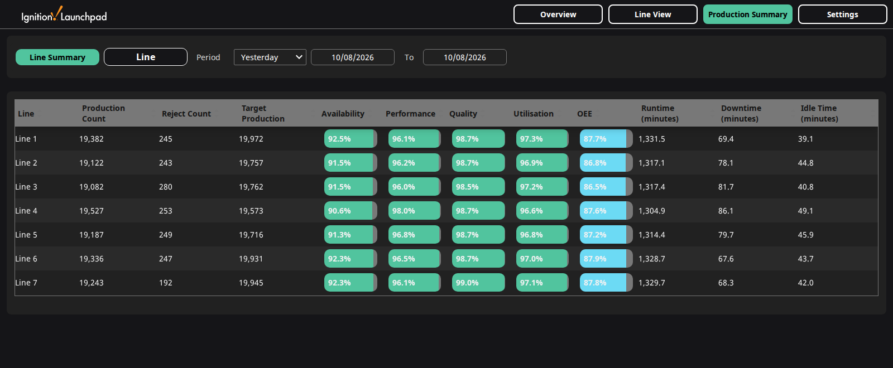
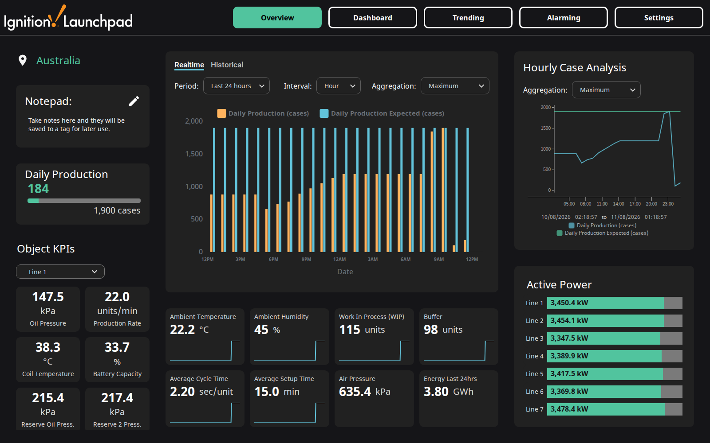

# Launchpad OEE + KPI — Australian port

Two Ignition 8.3 Perspective demonstration resources: **OEE** across seven simulated
production lines, and a plant **KPI** overview with a drag-and-drop dashboard. Both are
ports of the Inductive Automation *Launchpad* Exchange resources — metric, DD/MM/YYYY,
a shift roster that covers the whole day, and a flat tag layout.

Everything runs from a self-contained simulator. No PLC, no OPC server, no field device.

## OEE — seven lines, live Availability / Performance / Quality / Utilisation



## Line View — per-line OEE and production against target



## Production Summary — every line, any period



## KPI — plant overview over 61 simulated instrument tags



## Dashboard — ten widget types, editable from the running session


---

## What is in here

| Path | What |
| ---- | ---- |
| `dist/*.zip` | **the two Exchange packages** — import-ready, built by `./package.sh` |
| `exchange/` | the MANIFEST, README and LICENCE that go into each package |
| `final/` | the two projects exactly as they run on the gateway |
| `live-config/` | gateway config resources — tags, UDT types, database, historian, simulator |
| `tools/install.sh` | one-command install onto any reachable gateway |
| `tools/` | the supporting scripts — metrication, tag exports, screenshots, scroll checks |
| `docs/REPAIR.md` | the full engineering record: what was broken, what was fixed, and why |
| `testbed/` | throwaway 8.3.6 gateway used to prove the installer from empty |

`dist/` is generated; run `./package.sh` to rebuild it.

## Install

Two ways, both documented in full in each package's own README.

**Automated**, if you can reach the target's container — about four minutes unattended,
and idempotent:

```bash
tools/install.sh --container your-ignition-container \
                 --url http://your-gateway:9088 \
                 --gateway <credentials-stanza> [--ssh your-ssh-host]
```

**By hand**, from the packages: create the `launchpad` tag provider, the `Examples`
database and the `launchpad` historian; import the project; import the tags (UDT types
first); set the gateway scripting project; then run the seeding endpoints. The `Gateway/`
folder in each package carries those config resources if you would rather drop them in
and run a **Config → Scan File System**.

## What "AU" changes

This is a port, not a rewrite — the screens, the OEE engine and the UDT structure are
the original's.

- **Metric, converted at source.** The simulator generates °C and kPa and the tags carry
  metric `engUnit` and engineering ranges, so values, axis labels, sparkline legends,
  history and gauges all agree. The original converted at display time only, which left
  the tags themselves reading `PSI` and `F`.
- **DD/MM/YYYY and 24-hour time** through the projects' own labels, tables and date
  pickers. Two components draw their own axis labels in a fixed US format regardless —
  see *Known cosmetic issues* below.
- **A shift roster that covers the day.** The original ships three shifts *disabled*,
  spanning 09:00–21:30 with a twelve-hour hole. This runs a 3 × 8h roster —
  22:00–06:00, 06:00–14:00, 14:00–22:00 — enabled on all seven lines.
- **A flat tag layout**, `[Launchpad]OEE/…` and `[Launchpad]KPI/…`, rather than
  `[Launchpad]Exchange/Launchpad/…`.
- **Portable history paths**, derived from the gateway's own system name rather than
  baked in. The original hard-coded a gateway name into every `histprov:` path — in the
  dashboard seed *and* in the Trending page's chart pens.
- **Installer endpoints**, so the one-time setup can be driven without opening a Designer.

## Bugs fixed in the original resource

Found while getting these running; none were introduced by the Australian changes.

1. **Shifts crossing midnight were dated a day early.** `CurrentShiftStartTime`
   unconditionally did `addDays(now(), -1)` whenever `StartTime > StopTime` — correct
   after midnight, wrong before it. The original avoids the problem by shipping shifts
   that never cross midnight, which is also why they ship disabled.
2. **OEE could exceed 100%.** Nothing clamped `Performance`, so a just-rolled-over
   interval or a line running above target reported over 100%; a counter reset could
   produce figures in the thousands. A, P and U are now capped at 1.
3. **The Trending page only worked on the gateway it was built on.** Both Power Chart
   pen sources and the tag-browser path hard-coded a gateway system name, so anywhere
   else the pens read `Bad_NotFound` and the tag browser was empty. They now resolve
   from `[System]Gateway/SystemName`, the same way the project's popup views already
   did. This survived earlier testing because the development gateway still held a
   retired history generation under the old name, which made it look like it worked.
4. **The KPI history backfill wrote to the wrong table.** It composed the partition name
   as `sqlt_data_1_<this month>` — but the `1` is a historian driver id, not a constant,
   and the month is whatever month it is. On a gateway that had ever been renamed, or
   installed in any month other than the one it was written in, every seeded sample
   landed somewhere the charts do not read. It now resolves the driver and partition
   from the database.
5. **`##.0%` dropped the leading zero.** In an Ignition number-format pattern `#` is an
   optional digit, so anything under 1% rendered as `.0%`. The pattern lives on the OEE
   UDT, where every consumer reads it.
6. Smaller ones: the overview had no scroll at laptop height, so lines 5–7 were
   unreachable; the Production Summary column header read `Runime`; and the OEE
   project shipped `en-US` while KPI shipped `en-AU`.

## Known cosmetic issues

Left alone deliberately, and worth knowing before you go looking:

- The small **A / P / Q badges** on each OEE progress bar clip at the card's right edge.
  Stock behaviour.
- The **Time Series Chart** and **Power Chart** draw their own axis labels and range
  footers in a fixed US format (`8-7-2026`, `3:03 AM`) that does not follow the session
  locale. That is the components' own rendering, not a project setting — everything the
  projects themselves format is DD/MM/YYYY and 24-hour.
- Session **`timeZoneId` is `UTC`**. Set it to your own zone (`Australia/Sydney`, etc.)
  on the target gateway; there is no single right answer to ship.
- Shortly after midnight the Line View charts look nearly empty. That is honest — the
  default window is the current day, and the chart drops the still-running interval.

## Licence

MIT — see `exchange/LICENSE`. The original Launchpad resources are the property of
Inductive Automation; this is a derivative port published in the same spirit.
