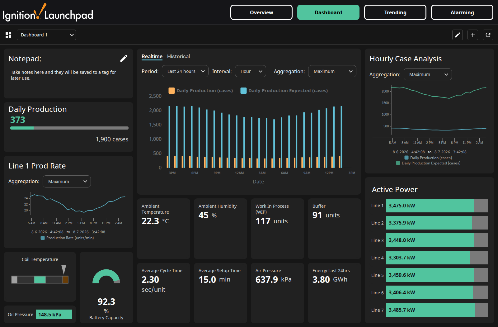

# Launchpad KPI (AU)

An Australian port of the Inductive Automation **Launchpad KPI** Exchange resource.

## Why this exists

Inductive Automation's Launchpad KPI demo is a good showcase of a
configurable plant dashboard, but — like the companion OEE resource — it
ships in US units and formats, and its history paths are hard-coded to the
gateway that built it. This is a straight port: metric converted at the
source (not just displayed), DD/MM/YYYY, 24-hour time, and history paths that
resolve on whatever gateway you install it on, plus two bugs fixed along the
way. Everything runs from a programmable simulator device; no PLC or field
hardware is required.

## What it looks like

*Overview — plant-wide production and instrument KPIs, realtime or historical.*

*Dashboard — ten widget types, add/move/configure from the running session.*

## What it does

- A plant KPI overview across **61 simulated instrument tags** on seven
  production lines.
- A **drag-and-drop dashboard** with ten widget types (gauges, sparklines,
  trend charts, KPI tiles and more), editable from the running session and
  persisted to the `Examples` database.
- A **Trending** screen and an **Alarming** view, both driven from the same
  tag set.
- Metric values converted **at the source** — the simulator generates °C and
  kPa, and the tags carry metric `engUnit` and engineering ranges, so values,
  axis labels, sparkline legends, history and gauges all agree.
- A WebDev installer endpoint that seeds the dashboard tables and 48 hours of
  tag history without opening a Designer.

## How to use it

### Install

1. **Gateway resources.** Create a tag provider named `launchpad`, a database
   connection named `Examples`, a tag historian named `launchpad` pointing at it, and
   a **Programmable Simulator** OPC device named `Launchpad`. `Gateway/` carries all
   four as 8.3 config resources if you would rather drop them in and run a
   **Config → Scan File System**. `Examples` is SQLite at `${data}/Examples.db` so the
   resource stays self-contained; point it at Postgres or MSSQL instead if you prefer.
2. **Simulator programme.** Load `Tags/launchpad-simulator.csv` into the `Launchpad`
   device. This is what gives every tag a value — without it the tags read stale.
3. **Project.** Import `Projects/KPI.zip`.
4. **Tags.** Import `Tags/launchpad-kpi-tags.json` into the `launchpad` provider.
5. **Seed the dashboard and history** — see below.

If you are installing this alongside *Launchpad OEE (AU)*, the tag provider, database
and historian are the same resources in both packages; whichever you install second is
a no-op for those three.

### Seeding

The project carries a WebDev endpoint, `kpi_init`. **It ships requiring
authentication**; either log in first or set `require-auth: false` on the resource
while you run these, then set it back.

    GET /system/webdev/KPI/kpi_init?action=<action>

| action | what it does |
|--------|--------------|
| `initDashboard` | creates the dashboard tables and seeds two example dashboards with 41 widgets |
| `backfill` | seeds 48 h of tag history so the charts and sparklines are not empty on day one |
| `repairBackfill` | moves mis-columned integer samples into `intvalue` |
| `status` | lists the dashboard tables — read-only |

Run `initDashboard`, then `backfill`. Both are idempotent; `initDashboard` issues bare
`CREATE TABLE` statements, so re-running the underlying script directly would throw
half-way, and the endpoint checks first and skips.

`backfill` takes `hours` (default 48), `step` in minutes (default 15) and `force=1`.
Use `force=1` to discard the existing samples and re-seed — worth doing if you rescale
a tag, so one series does not end up holding two different units.

Without the backfill nothing is broken; the charts simply fill in from live data over
the following hours.

### If you would rather not ship an HTTP endpoint

Delete the `kpi_init` resource and call `exchange.launchpad.init.initDashboard()` from
a Designer script console. There is no script equivalent for the history backfill —
let the charts populate from live data instead.

---

## What "AU" changes

This is a port, not a rewrite. The screens and the widget catalogue are the original's.
What differs:

- **Metric throughout, converted at source.** Temperatures in °C, pressures in kPa.
  The simulator generates metric values and the tags carry metric `engUnit` and
  engineering ranges, so the numbers, the axis labels, the sparkline legends, the
  history and the gauges all agree. (A display-time conversion would not: anything
  reading the tag's own metadata — the sparkline legend does — would still say PSI,
  and the trend charts would plot the raw stored value in °F.)
- **Dates DD/MM/YYYY and 24-hour time**, and the app bar hidden — the charts included.
  The Time Series Chart and Power Chart default to US forms (`M-D-YYYY`, `h:mm A`) for
  their range footers and x-trace boxes, and those are all set here. The Power Charts
  keep the `Auto` tick format, because the user drives their range picker to any span
  and no single fixed format survives that; their footers and info boxes carry the
  unambiguous date.
- **The session timezone follows the client.** `timeZoneId` is empty, which is the
  component's own default. Set it explicitly on the gateway only if you want to pin
  every session to one zone regardless of who opens it.
- **A flat tag layout.** `[Launchpad]KPI/…` rather than
  `[Launchpad]Exchange/Launchpad/…`, and the simulator's browse paths match, so the
  two stay in step.
- **Portable history paths.** The original hard-coded a gateway name into every
  `histprov:` path — both in the dashboard seed and in the Trending page's own chart
  pens — so the charts resolved only on the machine it was built on, and read
  `Bad_NotFound` anywhere else. Both are now derived from the gateway's own system
  name: the seed at seed time, the Trending pens through a binding on
  `[System]Gateway/SystemName`.
- **An installer endpoint** so the one-time setup can be driven without opening a
  Designer (see *Custom Instructions* above).

Conversions used: °F → °C as `(v − 32) × 5/9`, PSI → kPa as `v × 6.894757`. Ambient
air lands around 620–655 kPa and ambient temperature around 22 °C.

## Bugs fixed in the original resource

**The history backfill wrote to the wrong table.** It composed the partition name as
`sqlt_data_1_<current month>`. Neither part is safe to assume: the `1` is a historian
driver id, and the historian allocates a new one whenever the gateway's system name
changes — so on any gateway that had ever been renamed, the seeded samples landed in a
retired partition the charts do not read, and every chart looked empty. The month was
equally fixed, so an install in any later month wrote to a table that need not exist.
It now resolves the current driver and looks the partition up in `sqlth_partitions`,
and reports anything that falls outside one rather than seeding a shorter window in
silence.

**And its idempotency guard never fired.** The guard called `system.db.runScalarQuery`
with an `args=` list; the plain form does not bind arguments, so the count came back 0
and every run re-seeded 48 h of history on top of what was there. It now uses
`runScalarPrepQuery` and counts samples inside the requested window, so re-running
`backfill` is a no-op and `force=1` remains the way to deliberately re-seed.

## Notes

- The dashboard is editable from the running session: add, move and configure widgets
  from the ten in the catalogue, and dashboards persist to the `Examples` database.
- The `Placeholder` tag is deliberate — it is what a newly added widget points at
  until you choose a tag.

## Licence

MIT — see `LICENSE`. The original Launchpad resource is the property of Inductive
Automation; this is a derivative port published in the same spirit.
