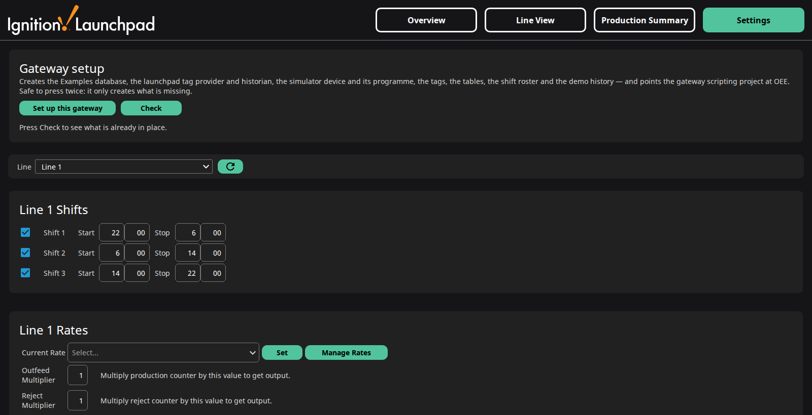

# Launchpad OEE (AU)

An Australian port of the Inductive Automation **Launchpad OEE** Exchange resource.

## Why this exists

Inductive Automation's Launchpad OEE demo is a good showcase, but it is built
around US units and date conventions. This is a straight port for an
Australian site: metric at the source, DD/MM/YYYY, 24-hour time, and a
standard 3 × 8h roster running around the clock. Everything runs from a
self-contained simulator; no PLC or field device is required.

## What it looks like

*Overview — all seven lines at a glance, realtime or historical, by the hour.*

*Line View — one line's OEE trend and production-vs-target over the selected window.*

*Production Summary — every line, any date range, runtime/downtime/idle included.*

*Settings — the whole install: import the project, press this.*

## What it does

- Seven simulated production lines with live **Availability, Performance,
  Quality and Utilisation**, computed per hour, per shift and per day.
- A SQL history of shift and hourly statistics backing the Line View trend
  charts and the Production Summary table.
- A 3 × 8h shift roster (22:00–06:00, 06:00–14:00, 14:00–22:00) enabled on
  all seven lines out of the box.
- A **Setup button** on the Settings screen that builds the gateway this
  needs — database, tag provider, historian, simulator, tags, tables, roster
  and 30 days of demo history — and a Check button that reports what is in
  place.
- Metric units, DD/MM/YYYY dates and 24-hour time throughout the project's
  own screens — see *What "AU" changes* below.

## How to use it

### Install

1. **Import the project** — `Projects/OEE.zip`. On the gateway that is
   **Platform → Projects → Import Project**; the dialog asks for a name, and it
   has to be `OEE`, because setup points the gateway scripting project at it by
   name.
2. **Open Settings** in the running project and press **Set up this gateway**.

That is all of it. The button creates the `Examples` database, the `launchpad` tag
provider and historian, the simulator device and its programme, the tags and their UDT
types, the tables, the 3 x 8h shift roster and 30 days of demo history — and points the
gateway scripting project at OEE. It narrates each step as it goes, and creates only
what is missing, so pressing it twice is safe. **Check** beside it reports what is and
is not in place and changes nothing.

The tags ship inside the project, so there is nothing to import separately. `Tags/` and
`Gateway/` are still in the package for anyone who would rather bring the tags in
through a Designer or drop the config resources in by hand, but the button needs
neither.

If you are installing both packages, the tag provider, database, historian and
simulator are the same resources in each; whichever you set up second finds them
already there and moves on.

### Driving it without the UI

Everything the button does is also a WebDev call, for anyone scripting an install:

    GET /system/webdev/OEE/lp_init?action=setup     build whatever is missing
    GET /system/webdev/OEE/lp_init?action=check     report state, change nothing

The other actions the endpoint carries are listed in `docs/` in the repo. It ships
requiring authentication; log in first, or set `require-auth: false` on the resource
while you use it and then set it back.

### If you would rather not ship an HTTP endpoint

Delete the `lp_init` resource. The Setup button does not go through it — it calls
`exchange.launchpad.setup.run()` directly — so removing the endpoint costs you the
scripted install and nothing else. From a Designer script console the same functions
are `exchange.launchpad.setup.run()` and `.check()`, or the individual steps
`exchange.launchpad.oee.initTables()`, `.setupShifts()`, `.seedHistory()`,
`.resetDemoTags()` and `.initDemoTags()`.

---

## What "AU" changes

This is a port, not a rewrite. The screens, the OEE engine and the UDT structure are
the original's. What differs:

- **Metric and local conventions.** Temperatures in °C, pressures in kPa, dates
  DD/MM/YYYY, 24-hour time, and the app bar hidden. (Most of the metrication lands in
  the companion *Launchpad KPI (AU)* resource, which is where the instrument tags live.)
  That includes the charts: the Time Series Chart's `dateFormat`, `timeFormat` and
  `timeAxis.tick.label.format` are all set explicitly rather than left at their US
  defaults. The Line View's tick format is *bound to the selected interval* — `HH:mm`
  for Hour, `DD/MM HH:mm` for Shift, `DD/MM` for Day — because one fixed format cannot
  serve a chart whose range runs from Yesterday to Last 365 Days.
- **The session timezone follows the client.** `timeZoneId` is empty, which is the
  component's own default. Set it explicitly on the gateway only if you want to pin
  every session to one zone regardless of who opens it.
- **A shift roster that covers the whole day.** A standard 3 × 8h roster —
  **22:00–06:00, 06:00–14:00, 14:00–22:00** — enabled on all seven lines, with the
  seeded history matching those boundaries.
- **A rolling realtime window.** Realtime covers the last 24 hours, 7 days or 30 days
  for the Hour, Shift and Day intervals rather than the calendar day, so the screens
  are populated at any hour.
- **A flat tag layout.** `[Launchpad]OEE/…` rather than
  `[Launchpad]Exchange/Launchpad/Oee/…`. Shorter paths, and the folder is `OEE` in
  capitals throughout.
- **A Setup button**, so a working demo is an import and one click rather than a
  five-step gateway configuration. The same thing is reachable as a WebDev endpoint
  for anyone scripting it.

## Notes

- The demo lines are memory tags driven by two tag event scripts under
  `OEE/Demo/Sim`; there is no device to configure.
- **Realtime is a rolling window** — the last 24 hours by hour, the last 7 days by
  shift, the last 30 days by day. The charts, the averages and Top Production are
  therefore populated whatever time of day you open the project. Historical mode takes
  an explicit period.

## Licence

MIT — see `LICENSE`. The original Launchpad resource is the property of Inductive
Automation; this is a derivative port published in the same spirit.
